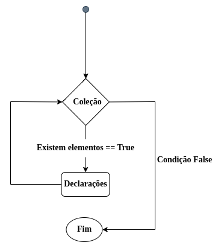

<!--header: Entendendo um pouco mais sobre o uso do forEach-->

### Foreach
Fluxograma



<!--footer: forEach conceitos-->

---

## Qual diferença entre for e foreach??

Então pra que diabos eu vou usar o forEach se o for já supre minha necessidade? :confused:

---

#### Exemplo de uso do FOR
```js
const frutas = ['Banana', 'Cereja', 'Abacate', 'Uva'];

for(let i = 0; i < frutas.length; i = i + 1 ) {
    console.log('Fruta: ', frutas[i]);
}

            Resuldado: 

                Fruta: Banana
                Fruta: Cereja
                Fruta: Abacate
                Fruta: Uva  
```
---

#### Exemplo de uso do forEach

```js
const nomes = ['Nathan', 'Eduardo', 'Fabio', 'Lucas'];

nomes.forEach(function(nome) {
    console.log('Pessoas: ', nome);
})

            Resuldado

                Pessoas: Nathan
                Pessoas: Eduardo
                Pessoas: Fabio
                Pessoas: Lucas
```
---

forEach permite que passemos uma função como parametro de call back para que execute a sua iteração

```js

const network = ['youtube', 'facebook', 'instagram'];

function funcao(socialnet) {
    console.log(socialnet)
}

network.forEach(funcao)

```

---

### E o call back, o que é call back?

Call back é um recurso de funcões que permite executar um código apos outro bloco de código ser executado, esperando uma resposta para fazer alguma ação. So realizará a execução apos a função de call back ser executada.

---
Exemplo sem call back

```js
function soma(a, b) {
    let op = a + b;
    console.log(op)
}

function multiplicacao(a, b,) {
    let op = a * b;
    console.log(op)
}

soma(2, 2);
multiplicacao(2, 2);

```

---

Exemplo com call back
```js
function exibir(num) {
    console.log("A operação resultou em ", num)
}

function soma(a, b, exibir) {
    let op = a + b;
    exibir(op)
}

function multiplicacao(a, b, exibir) {
    let op = a * b;
    exibir(op)
}

soma(2, 2, exibir);
multiplicacao(a, b, exibir);

```

---

# Parâmetros

ForEach permite a inserção de 3 argumentos base para realizar o laço.

1º - Valor atual 
2º - Indice
3º - array completo

---
> Sempre que você for fazer um loop for, vale mais a pena usar um forEach, pois ele elimina a carga mental de ter que lidar com as variáveis de controle e por consequência pode ajudar a deixar o código mais fácil de ler, levando em conta que essa é uma forma super usada no mundo JavaScript em geral.

