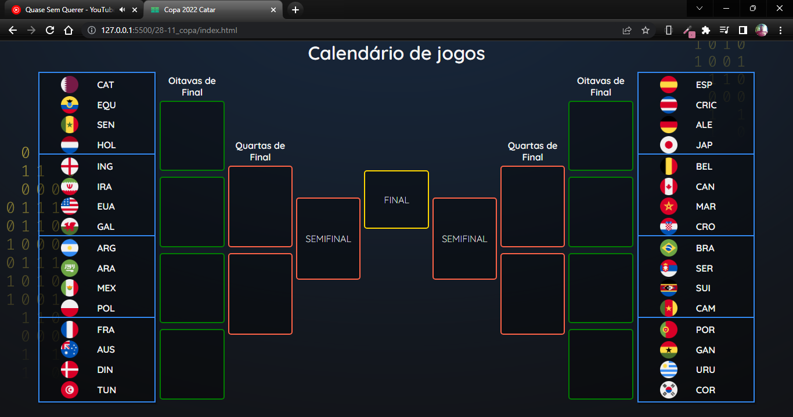

# :earth_americas: Repositório de exercicios 
Aqui ficará a linha do tempo de todos os exercicios propostos pela equipe da Digital College

## :white_check_mark: 14/11 - Criação de curriculo virtual

Exercicio para realizar um curriculo virtual no qual apliquei HTML5 e CSS3 com conceitos básicos de FlexBox

### Linguagens usadas

---

## :white_check_mark: 21/11 - Aula de Git
comandos básicos e boas práticas para o uso github.

---

## :white_check_mark: 28/11 - Calendário da copa
Criado o calendário da copa com Html e CSS
Utiizado Flexbox para alinhamento das caixas, design responsivo para mobiles.
### Linguagens usadas

